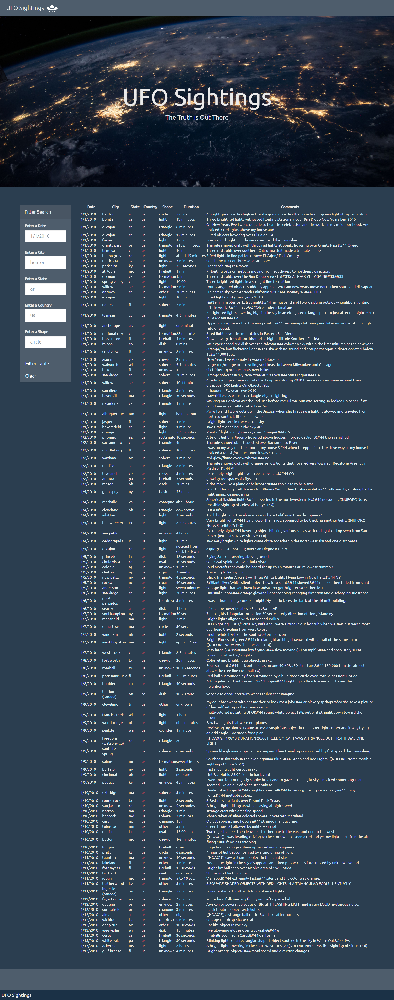

# UFO Sightings
## Summary
* A homework assignment for UC Berkeley's Data Analytics Bootcamp
* Project uses JavaScript to create interactive filters of UFO sightings data
## Final Product
* See the deployed website here: https://mileslucey.github.io/ufo_sightings/

